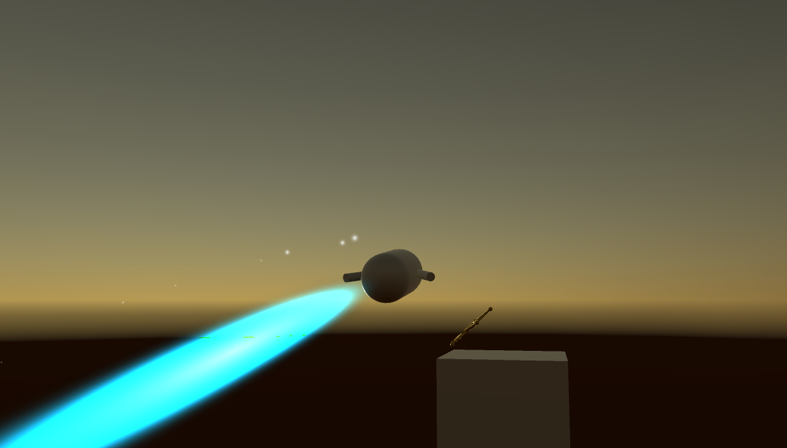
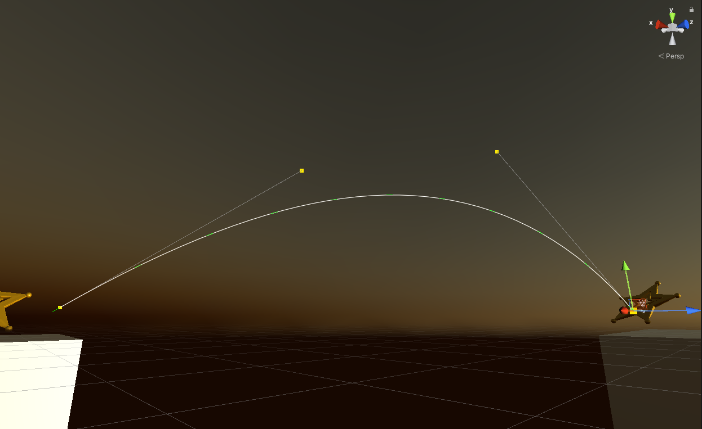
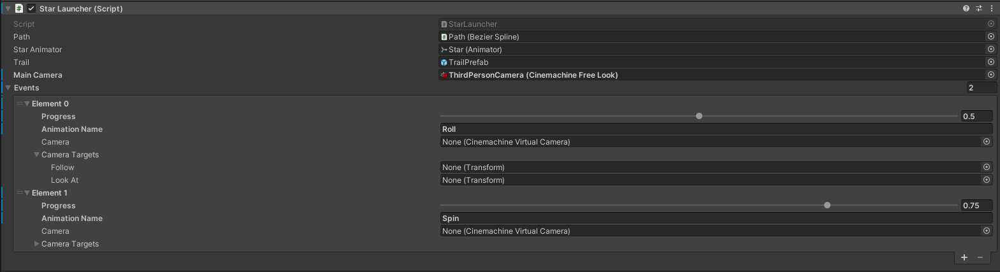
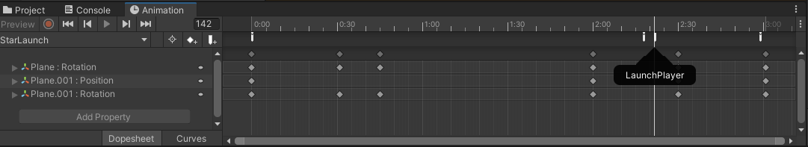
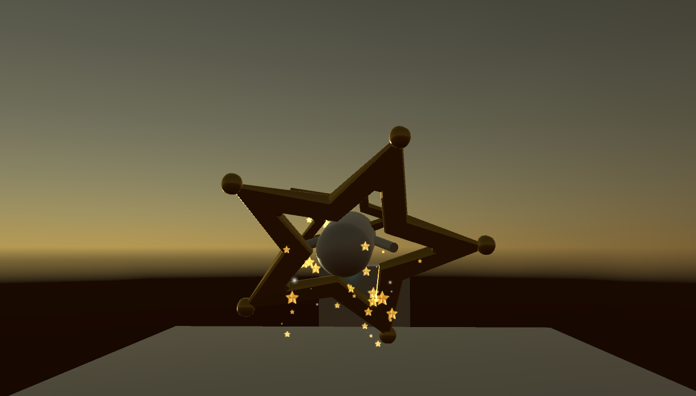

# Mechanics Creation

## Chapters
1. [Mario Galaxy Star Launch](#MarioGalaxyStarLaunch)
 

# MarioGalaxyStarLaunch

From Maël Le Gal, inspired by MixAndJam [video](https://www.youtube.com/watch?v=T_3cne2tzYM) and [Github](https://github.com/mixandjam/MarioGalaxy-LaunchStar).

    </img>

## Character

The character is a simple capsule with a Character Controller. To capture and move the capsule multiple scripts were created. First of all the character is represented by a script Character containing his current state and multiple values for his speed, jump speed and even gravity. 

The second script is called CharacterInputManager and captures each inputs from the player using the Input and Axis system of Unity. This script change the character state represented by classes (IdleState, RunningState, JumpingState, FallingState, FlyingState) each implementing the handleInput method using the character to change his MoveDirection.

    </img>

## Camera

For the camera, I used the Cinemachine camera to create the Third Person Camera to control the player. It follows and look at the character. Multiple other camera were added in the scene to switch to while flying in the air.

## Tool

To create the path followed by the player once he is launch from a star, I used the [CatLikeCoding Tutorial](https://catlikecoding.com/unity/tutorials/curves-and-splines/) to implement a tool to create Bezier curves and make a walker on those curve. The script created gives us tools directly in the scene and the editor using handle for example to move the control points of the curves.

    </img>

## Star Launch

The Star Launch is composed of two major script, the StarLauncher and the StarLauncherWalker. The first one is notified by the CharacterInputManager once the player push the E button to Launch the onTrigger Method that will sets the player inside the star, change his state and then start the star animation. By the end of this animation a StarLauncherWalker will be created, parenting the character, and moving along the path. 

In the StarLauncher, two structure were defined to create events along the path, the event would take a value corresponding to the progression on the path, and could take either or both an animation name, and a camera with a structure for the transform to follow or look at. Those events would be pushed into a Queue that will then be passed to the walker at his creation. The walker will then process those events at the corresponding time on the progress along the path.

    </img>

## Animations and Particle effects

Just like I mentionned previously, I used animations in this project. Those animations were tied to the creation of the walker using events at certain key frames. It's also using those same events that the particles emitters are started or stopped.

    </img>
    </img>

